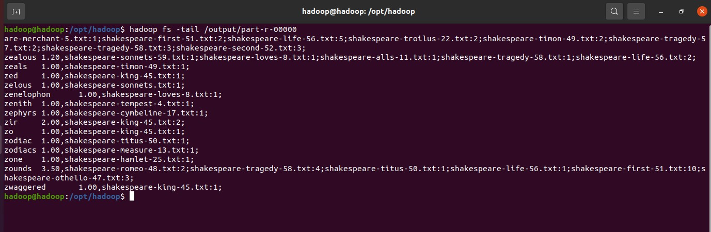

# exp2
## 实验说明

实现基于hadoop的带词频属性的文档倒排算法，计算每个单词的平均出现次数。

- 平均出现次数：词语出现总数 / 含有该词语的文档总数
- 输出格式：
    word \t average_num,filename:num;... ...;filename:num;
    

## 输出文件

 - 路径：out/artifacts/exp2_jar/exp2.jar
 - 执行方式：
    启动hadoop后，在命令行输入hadoop jar /path_to_exp2.jar/exp2.jar /path_of_input /path_of_output
